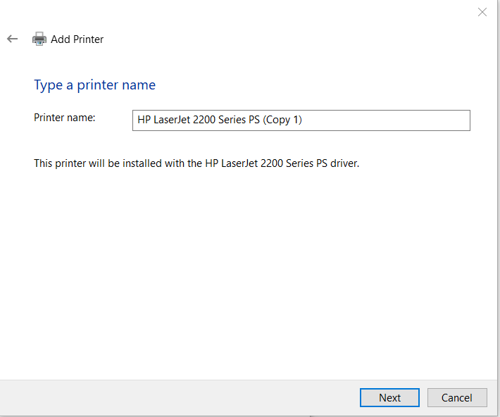
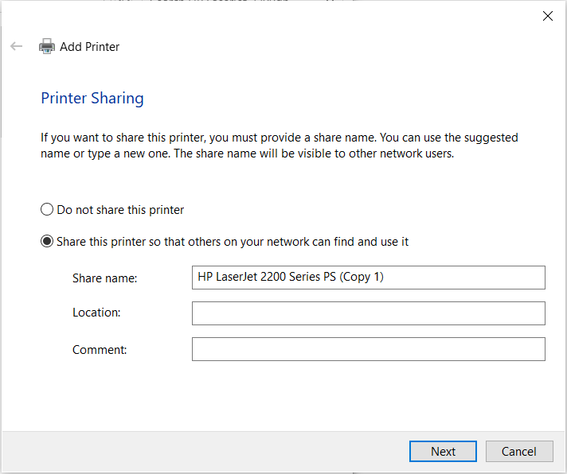

# HP-LaserJet 2200dn Tutorial

## Trykk add printer

## Trykk "The printer I want isn't listed"

## Velg IP/TCP

## Skriv inn IP-addressen 192.168.1.199

## Velg HP og driveren "HP LaserJet 2200 Series PS"

## Velg navn for printeren

## Trykk next

## Velg recommended

