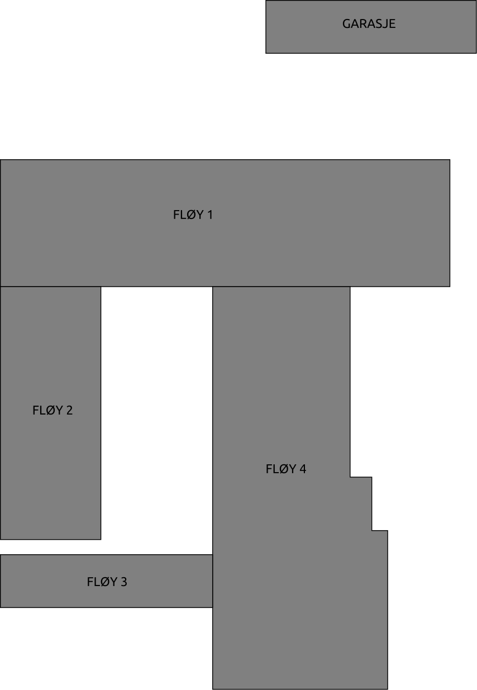

<h1>EidVGS Data and electronics network mapping</h1>

<p>In this repository me and my class is creating an network map for our classes</p>
<p>Mostly it will cover the patch panels and network terminations</p>

## Romkodar
```
1-124 = Lager
1-129 = 2ELA Klasserom ??
1-130 = LAB
1-132 = 2AUA Klasserom 4
2-101 = 3DEA Klasserom 101
2-115 = 2DEA Klasserom 8
2-116 = 3AUA Klasserom 9
x-XXX = Loft
x-XXX = Garasje

```

## Blokk - Etasje- Rom - Dør
```
 
  |-------> BLOKK
  |
  | |-------> ETASJE
  | |  
  | | |-------> ROM
  | | |
  | | ||--------> DØR
  X-YXXA
  
  
```

```
DE	= Data og Elektronikk undervisning
D	= SFJ bygg
R1	= Rack 1					       
P1	= Patch Panel 1	 (Panel i rack, skap eller på vegg)
```


## Ei liste med oppgåver 

* Terminere 3DEA-2DEA, Terminere 3DEA-3AUA, forlenge ledningar i 3DEA rack 1
* Kva har vi av utstyr i dei forskjellige romma
* Kva er allerede dokumentert
* Verifisere dokumentasjonen
* Terminere alle lause ledninger (Fullføre arbeidet starta våren 2018)
* Ny kabling (Til pultane på 2DEA og til pultane på 3DEA, til møterommet ?)
* Vi lagar teikningar av alle romma på papir (rå skisse) Denne krysssjekkar vi mot patch panel dokumentasjonen


## Panel list
[comment]: # (Autotable start)

|                  Panel                 |   Coordinator   |                  TODO                 |             Status             |
|----------------------------------------|-----------------|---------------------------------------|--------------------------------|
|[Loft](Panels/Loft.md)                  |Jarl Even        |-                                      |New                             |
|[Garasje](Panels/Garasje.md)            |Jarl Even        |-                                      |New                             |
|[External](Panels/External.md)          |Jarl Even        |Dokumenter link til loft               |WIP                             |
|[DE2116A-R1-P1](Panels/DE2116A-R1-P1.md)|Tommy/Simon      |Verifiser<br/>Måle lengde og dempning  |New                             |
|[DE2115A-R1-P1](Panels/DE2115A-R1-P1.md)|Vegard og Martin |Måle lengde og dempning                |New                             |
|[DE2101A-R3-P2](Panels/DE2101A-R3-P2.md)|Rex              |N/A                                    |OK 31.08.2018                   |
|[DE2101A-R3-P1](Panels/DE2101A-R3-P1.md)|Rex              |Måle lengde og dempning                |Kopling OK                      |
|[DE2101A-R1-P3](Panels/DE2101A-R1-P3.md)|Rex/Simon        |N/A                                    |OK 31.08.2018                   |
|[DE2101A-R1-P2](Panels/DE2101A-R1-P2.md)|Aleksander/Eirik |Måle lengde og dempning<br/>terminere  |Merking OK                      |
|[DE2101A-R1-P1](Panels/DE2101A-R1-P1.md)|Augustin         |Måle lengde og dempning                |Verify 5-9 + 11-13              |
|[DE1132A-R1-P2](Panels/DE1132A-R1-P2.md)|Aleksander/Erik  |Verifiser<br/>Måle lengde og dempning  |NEW                             |
|[DE1132A-R1-P1](Panels/DE1132A-R1-P1.md)|Tommy/Simon      |Test #1..20<br/>Måle lengde og dempning|Merking OK for:<br/>#21,22,23,24|
|[DE1130A-R1-P5](Panels/DE1130A-R1-P5.md)|Augustin         |Rom# garasje                           |WIP                             |
|[DE1130A-R1-P2](Panels/DE1130A-R1-P2.md)|Mardon           |N/A                                    |OK 03.09.2018                   |
|[DE1130A-R1-P1](Panels/DE1130A-R1-P1.md)|Aleksander/Mardon|N/A                                    |OK 03.09.2018                   |
|[DE1129A-R1-P1](Panels/DE1129A-R1-P1.md)|Per Magnus       |-                                      |New                             |
|[DE1124A-R0-P1](Panels/DE1124A-R0-P1.md)|Mardon           |N/A                                    |OK 03.09.2018                   |

[comment]: # (Autotable stop)

## Drawings 
|                  Room                   |     Coordinator     | Paper | Electronic  |
|-----------------------------------------|---------------------|-------|-------------|
|[DE2101A](./Drawings/2101A-FloorPlan.svg)|Augustin             |       |             |
|[DE2115A](./Drawings/2115A-FloorPlan.svg)|Augustin             |       |             |
|[DE2116A](./Drawings/2116A-FloorPlan.svg)|Augustin             |       |             |


{ width=400px }


