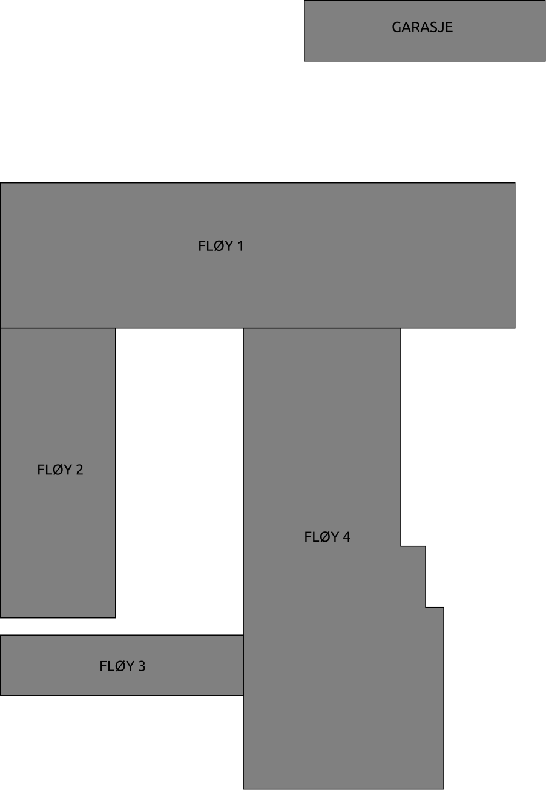

<h1>EidVGS Data and electronics network mapping</h1>

<p>In this repository me and my class is creating an network map for our classes</p>
<p>Mostly it will cover the patch panels and network terminations</p>

```
1-124 = Lager
1-129 = 2ELA Klasserom ??
1-130 = LAB
1-132 = 2AUA Klasserom 4
2-101 = 3DEA Klasserom 101
2-115 = 2DEA Klasserom 8
2-116 = 3AUA Klasserom 9
x-XXX = Loft
x-XXX = Garasje

```

## Panel list

[comment]: # (Autotable start)

|Patch|Coordinator|
|----|----|
|MAL|<Insert name>|
|Leftovers|Jarl Even|
|DE2116A-R1-P1|Tommy|
|DE2115A-R1-P1|Vegard og Martin|
|DE2101A-R3-P2|Rex|
|DE2101A-R3-P1||
|DE2101A-R1-P3|Rex/Simon|
|DE2101A-R1-P2|Aleksander/Erik|
|DE2101A-R1-P1|Augustin Winther|
|DE1132A-R1-P2|Aleksander/Erik|
|DE1132A-R1-P1|Tommy/Simon|
|DE1130A-R1-P5|Augustin Winther|
|DE1130A-R1-P2|Mardon|
|DE1130A-R1-P1|Jarl Even|
|DE1129A-R1-P1|Per Magnus|
|DE1124A-R0-P1|Mardon|

[comment]: # (Autotable stop)




* [Link to the mal file](Panels/MAL.md)

|                  Patch                 |     Coordinator     |Verified|Created|               TODO                 |
|----------------------------------------|---------------------|--------|-------|------------------------------------|
|[DE2101A-R1-P1](Panels/DE2101A-R1-P1.md)| Augustin            |        |DONE   |Kartlegge, måle lengde og demping   |
|[DE2101A-R1-P2](Panels/DE2101A-R1-P2.md)| Aleksander/Erik     |        |DONE   |Mål lengde og demping               |
|[DE2101A-R1-P3](Panels/DE2101A-R1-P3.md)| Rex/Simon           |No      |DONE   |Mål lengde og demping               |
|[DE2101A-R3-P1](Panels/DE2101A-R3-P1.md)| Rex                 |        |DONE   |Mål lengde og demping               |
|[DE2101A-R3-P2](Panels/DE2101A-R3-P2.md)| Rex/Simon           |No      |DONE   |Mål lengde og demping               |
|[DE2116A-R1-P1](Panels/DE2116A-R1-P1.md)| Tommy               |        |DONE   |                                    |
|[DE1130A-R1-P1](Panels/DE1130A-R1-P1.md)| Jarl Even           |        |DONE   |                                    |
|[DE1130A-R1-P2](Panels/DE1130A-R1-P2.md)| Mardon              |        |DONE   |                                    |
|[DE1130A-R1-P5](Panels/DE1130A-R1-P5.md)| Augustin            |        |DONE   |Kartlegge, måle lengde og demping   |
|[DE1132A-R1-P1](Panels/DE1132A-R1-P1.md)| Tommy/Simon         |        |DONE   |                                    |
|[DE1132A-R1-P2](Panels/DE1132A-R1-P2.md)| Aleksander/Erik     |        |DONE   |                                    |
|[DE1129A-R1-P1](Panels/DE1129A-R1-P1.md)|                     |        |DONE   |                                    |
|[DE1124A-R1-P1](Panels/DE1124A-R0-P1.md)|                     |        |DONE   |                                    |
|Garasje fiber                           |                     |        |NO     |                                    |
|[External](Panels/Leftovers.md)         | Jarl Even           |        |DONE   |                                    |
|Loft                                    | Jarl Even           |        |NO     |                                    |


## Drawings 
|    Room     |     Coordinator     | Paper | Electronic  |
|-------------|---------------------|-------|-------------|
|DE2101A      |Augustin             |       |             |
|DE2115A      |Augustin             |       |             |
|DE2116A      |Augustin             |       |             |


## Ei liste med oppgåver 

* Kva har vi av utstyr i dei forskjellige romma
* Kva er allerede dokumentert
* Verifisere dokumentasjonen
* Terminere alle lause ledninger (Fullføre arbeidet starta våren 2018)
* Dokumentere 2ELA
* Ny kabling (Til pultane på 2DEA og til pultane på 3DEA, til møterommet ?)
* Lengde og demping høgrejustert
* Lengde og demping 1 desimal
* Lengde og demping bruke komma eller punktum
* "Tilkopling" bruke følgande form "DE-2101A-R1-P1 #22"  ikkje "DE-2101A-R1-P1-22"
* Overskrifta "DE 1130A - R1 - P1 LAB" i denne er LAB det same som rom 1130 altså labben
* Teikningar legg orginalen inn på GitHub (Vi ser på TortoiseGit https://tortoisegit.org/
* Vi ser og på enkel bruk av Git via CLI (Linux i dette tilfellet)
* Vi lagar teikningar av alle romma på papir (rå skisse) Denne krysssjekkar vi mot patch panel dokumentasjonen


